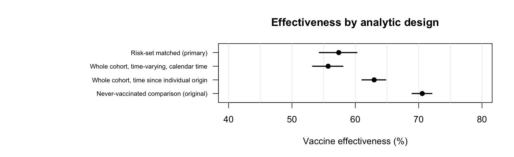
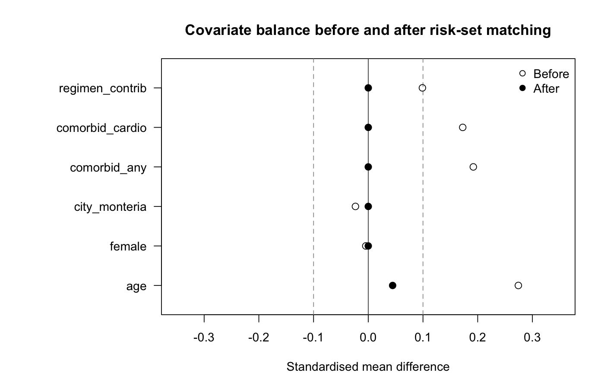

# COVID-19 vaccine effectiveness in two Colombian cities: a target trial emulation

Reproducible analysis pipeline for a population-based cohort study estimating the
effectiveness of Colombia's National Vaccination Plan against SARS-CoV-2 infection,
hospitalisation and death in Cali and Montería (February 2021 – June 2022).

**[Read the rendered report →](https://carlosreina-epi.github.io/covid19-vaccine-effectiveness-colombia/)**

The repository contains the full analysis code and a synthetic data generator, so
every step runs end to end without access to the original records.

## The causal question

Among residents of Cali and Montería who became eligible for vaccination under the
National Vaccination Plan, what would the risk of SARS-CoV-2 infection,
hospitalisation and death have been had everyone completed the primary vaccination
schedule, compared with had no one been vaccinated?

## Target trial protocol

| Component | Specification |
|---|---|
| **Eligibility** | Residents of Cali or Montería registered in the national vaccination and surveillance registries, eligible for vaccination under the National Vaccination Plan between 17 Feb 2021 and 30 Jun 2022 |
| **Treatment strategies** | (1) Complete the primary schedule: two doses 14–28 days apart. (2) Remain unvaccinated |
| **Assignment** | Observational; addressed by exact matching within risk sets |
| **Time zero** | Vaccinated: second dose + 14 days. Unvaccinated: the day their priority group became eligible under the National Vaccination Plan |
| **Outcomes** | Laboratory-confirmed SARS-CoV-2 infection; hospitalisation; death |
| **Follow-up** | From time zero to the outcome, 360 days, or 30 June 2022, whichever came first |
| **Causal contrast** | Per-protocol effect of completing the primary schedule |
| **Analysis** | Cox proportional hazards stratified by matched pair; effectiveness = 1 − HR |

Two design decisions do most of the work. Colombia's priority schedule opened
vaccination to age and comorbidity groups on fixed calendar dates, which gives every
person an eligibility date fixed at baseline and independent of their own later
decisions: that is the start of unexposed follow-up. And exposure is treated as
time-varying, so everyone contributes unexposed person-time until vaccination,
rather than the comparison group being restricted to people who were never
vaccinated at any point, a definition that conditions on future behaviour.

## How much the design matters

The same data analysed four ways, differing only in how time zero and the comparison
group are defined. The synthetic data carry a true effectiveness of 55%.

| Design | Vaccine effectiveness |
|---|---|
| Risk-set matched (primary) | 57.4% (95% CI 54.3 to 60.3) |
| Whole cohort, time-varying exposure, calendar time | 55.7% (95% CI 53.3 to 58.0) |
| Whole cohort, time since individual origin | 63.0% (95% CI 61.1 to 64.8) |
| Never-vaccinated comparison | 70.6% (95% CI 69.0 to 72.1) |

Designs that align exposed and unexposed person-time in calendar time recover the
true value. Measuring time from each individual's own origin compares person-time
from different phases of the epidemic; restricting the comparison group to the never
vaccinated compounds it.



## Results on synthetic data

| Outcome | Events | Vaccine effectiveness |
|---|---|---|
| Confirmed infection | 4,002 | 57.4% (95% CI 54.3 to 60.3) |
| Hospitalisation | 201 | 84.3% (95% CI 76.3 to 89.6) |
| Death | 75 | 87.7% (95% CI 74.3 to 94.1) |

Risk-set matching pairs 94.9% of eligible vaccinated individuals and brings every
standardised mean difference below 0.05.



## Data

The original analysis uses individual-level records from the national immunisation
registry (PAIweb), the national surveillance system (SIVIGILA) and vital statistics,
linked by national identifier under a data use agreement. **These data are not, and
will not be, included in this repository.**

`R/01_simulate_data.R` generates a synthetic dataset with the same variables,
categories, date ranges, missingness and confounding structure, and a known true
effectiveness of 55%, so that the pipeline can be validated end to end. Results
obtained from synthetic data are a demonstration, not study findings.

## Repository structure

```
R/00_functions.R        Shared helper functions
R/01_simulate_data.R    Synthetic data generator, daily hazard in calendar time
R/02_build_cohort.R     Eligibility, time zero, time-varying exposure
R/03_match.R            Risk-set matching and balance diagnostics
R/04_table1.R           Baseline characteristics
R/05_models.R           Cox models, effectiveness by window and subgroup
R/06_diagnostics.R      Proportional hazards, design comparison, E-value
index.qmd               Reproducible report
```

## How to run

Requires R with the `survival` package; everything else is base R. Quarto is needed
only to render the report.

```bash
Rscript R/01_simulate_data.R
Rscript R/02_build_cohort.R
Rscript R/03_match.R
Rscript R/04_table1.R
Rscript R/05_models.R
Rscript R/06_diagnostics.R
quarto render
```

Total runtime is under 30 seconds.

## Limitations

Outcome ascertainment depends on testing, which varied over time and between the two
cities; differential testing by vaccination status would bias effectiveness against
infection, though it should affect hospitalisation and death much less. Matching is
exact on recorded covariates only, and occupation, previous infection and household
exposure are not captured in these registries. Severe outcomes are dated at symptom
onset rather than at admission. Follow-up ends before boosters became widespread, so
the estimates describe the primary schedule alone. Sensitivity to unmeasured
confounding is quantified with an E-value in `R/06_diagnostics.R`.

## Citation

Reina Bolaños CA. *Evaluación de efectividad del Plan Nacional de Vacunación contra
el COVID-19 en dos ciudades colombianas durante el periodo de emergencia sanitaria.*
PhD thesis, Facultad Nacional de Salud Pública, Universidad de Antioquia, 2024.

Related published work: Reina-Bolaños CA, et al. Real-world effectiveness of the
CoronaVac vaccine in a retrospective population-based cohort in four Colombian
cities. *International Journal of Infectious Diseases* 2024.
[doi:10.1016/j.ijid.2024.107156](https://doi.org/10.1016/j.ijid.2024.107156)

## Author

Carlos Alberto Reina Bolaños, PhD — epidemiologist working on vaccine effectiveness
and causal inference with large linked health data.
[ORCID 0000-0002-6367-9239](https://orcid.org/0000-0002-6367-9239) ·
[LinkedIn](https://www.linkedin.com/in/carlos-reina-epi)

## License

MIT (see `LICENSE`).
