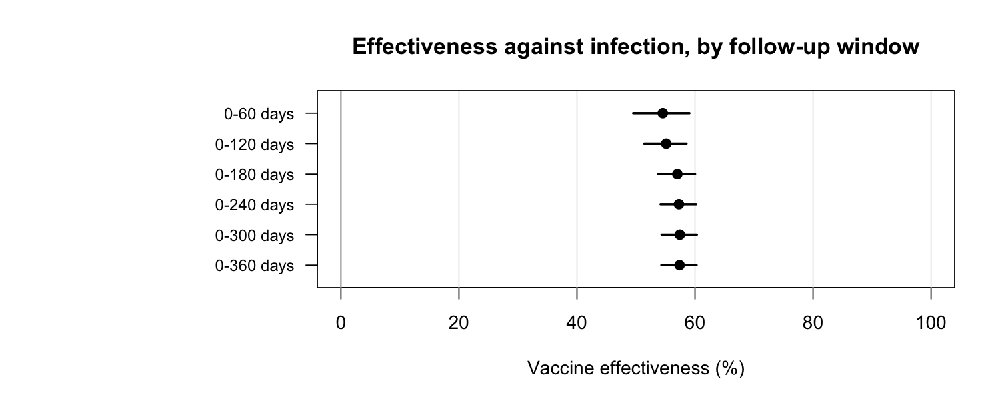
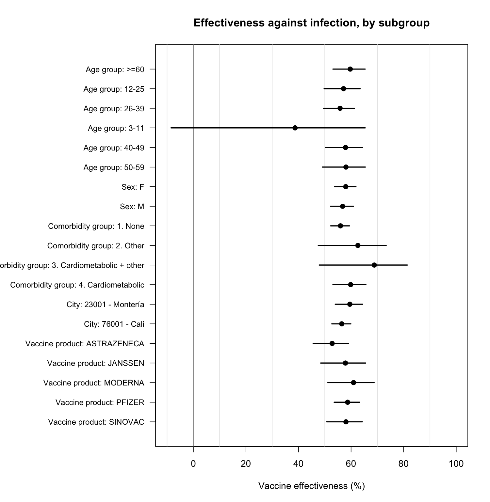
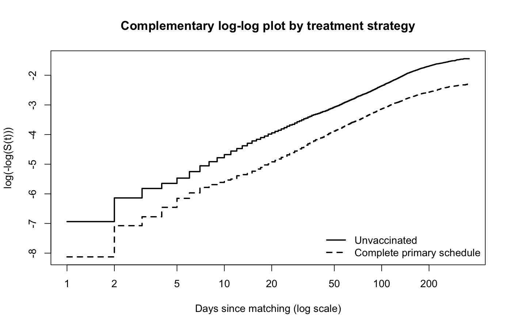

```{r setup}
#| include: false
source("R/00_functions.R")
library(survival)

# Run the pipeline if the derived objects are not there yet, so that a fresh
# clone renders from nothing but the code.
needed <- file.path("data/derived",
                    c("cohort_person_time.rds", "matched_pairs.rds",
                      "table1.rds", "ve_results.rds", "diagnostics.rds"))
if (!all(file.exists(needed))) {
  for (s in sprintf("R/%s", c("01_simulate_data.R", "02_build_cohort.R",
                              "03_match.R", "04_table1.R", "05_models.R",
                              "06_diagnostics.R"))) {
    message("Running ", s)
    source(s, local = new.env())
  }
}

matched     <- readRDS("data/derived/matched_pairs.rds")
person_time <- readRDS("data/derived/cohort_person_time.rds")
table1      <- readRDS("data/derived/table1.rds")
ve_results  <- readRDS("data/derived/ve_results.rds")
diagnostics <- readRDS("data/derived/diagnostics.rds")

pct <- function(x) sprintf("%.1f%%", 100 * x)
```

::: {.callout-note}
## Reproducibility

Every figure and number on this page was produced by the code in this
repository, run on **synthetic data** generated by `R/01_simulate_data.R`. The
original analysis used individual-level records from the national immunisation
registry, the national surveillance system and vital statistics, which are held
under a data use agreement and are not distributed here. The synthetic data
reproduce the structure, categories, missingness and confounding of that
extract, with a known true vaccine effectiveness of 55% built in, so the
pipeline can be validated end to end.

The numbers below are therefore a demonstration that the analysis recovers what
it should, not study findings.
:::

## The causal question

Among residents of Cali and Montería who became eligible for vaccination under
Colombia's National Vaccination Plan, what would the risk of SARS-CoV-2
infection, hospitalisation and death have been had everyone completed the
primary vaccination schedule, compared with had no one been vaccinated?

## Target trial protocol

| Component | Specification |
|---|---|
| **Eligibility** | Residents of Cali or Montería registered in the national vaccination and surveillance registries, eligible for vaccination under the National Vaccination Plan between 17 Feb 2021 and 30 Jun 2022 |
| **Treatment strategies** | (1) Complete the primary schedule: two doses 14–28 days apart. (2) Remain unvaccinated |
| **Assignment** | Observational; addressed by exact matching within risk sets |
| **Time zero** | Vaccinated: second dose + 14 days. Unvaccinated: the day their priority group became eligible |
| **Outcomes** | Laboratory-confirmed infection; hospitalisation; death |
| **Follow-up** | From time zero to the outcome, 360 days, or 30 June 2022, whichever came first |
| **Causal contrast** | Per-protocol effect of completing the primary schedule |
| **Analysis** | Cox proportional hazards stratified by matched pair; effectiveness = 1 − HR |

### Two design decisions that drive the result

**Time zero for the unvaccinated.** Colombia's priority schedule opened
vaccination to age and comorbidity groups on fixed calendar dates. That gives
every person an eligibility date determined at baseline, which does not depend
on their own later decisions, and which serves as the start of unexposed
follow-up.

**Exposure is time-varying.** Rather than defining the comparison group as
people who were never vaccinated during the whole study period — which
conditions group membership on future behaviour — every person contributes
unexposed person-time until they are vaccinated. The comparison is between
person-time under two strategies, not between two types of person.

## Cohort

```{r cohort-numbers}
#| echo: false
n_pairs <- length(unique(matched$pair))
data.frame(
  Quantity = c("Individuals in the source extract",
               "Person-time intervals, whole cohort",
               "  unexposed",
               "  exposed",
               "Matched pairs",
               "Median follow-up in matched pairs, days"),
  Value = c(format(length(unique(person_time$id)), big.mark = ","),
            format(nrow(person_time), big.mark = ","),
            format(sum(person_time$exposed == 0), big.mark = ","),
            format(sum(person_time$exposed == 1), big.mark = ","),
            format(n_pairs, big.mark = ","),
            format(round(median(matched$followup_days))))
)
```

### Baseline characteristics

Matching was exact on city, sex, age group, comorbidity group and insurance
scheme, so the two columns agree by construction on those variables.

```{r table1}
#| echo: false
knitr::kable(table1)
```

### Covariate balance


## Results

```{r primary}
#| echo: false
prim <- ve_results[ve_results$analysis == "Primary", ]
labels <- c(event_infection = "Confirmed infection",
            event_hospitalised = "Hospitalisation",
            event_death = "Death")
data.frame(
  Outcome = labels[prim$outcome],
  Events = prim$events,
  `Vaccine effectiveness` = sprintf("%s (95%% CI %.1f to %.1f)",
                                    pct(prim$ve), 100 * prim$ve_low, 100 * prim$ve_high),
  check.names = FALSE, row.names = NULL
)
```

### By follow-up window

Person-time is truncated at the end of each window, not only the event
indicator, so each row is a risk over that window rather than a mixture.



### By subgroup



## Diagnostics and sensitivity analyses

### Proportional hazards

```{r ph}
#| echo: false
diagnostics$ph_test
```



### How much the design matters

The same data, analysed four ways that differ only in how time zero and the
comparison group are defined. The true effectiveness built into the synthetic
data is 55%.

```{r design-comparison}
#| echo: false
cmp <- diagnostics$comparison
data.frame(
  Design = cmp$design,
  `Vaccine effectiveness` = sprintf("%s (95%% CI %.1f to %.1f)",
                                    pct(cmp$ve), 100 * cmp$ve_low, 100 * cmp$ve_high),
  check.names = FALSE, row.names = NULL
)
```


The two designs that align exposed and unexposed person-time in calendar time
recover the true value. Measuring time from each individual's own origin
compares person-time from different phases of the epidemic and overstates
effectiveness; restricting the comparison group to people who were never
vaccinated at any point compounds the problem.

### Unmeasured confounding

```{r evalue}
#| echo: false
ev <- diagnostics$evalue
cat(sprintf(
"E-value for the point estimate:      %.2f
E-value for the confidence limit:    %.2f

An unmeasured confounder would have to be associated with both vaccination and
infection by a risk ratio of at least %.2f, beyond the matched covariates, to
explain away the estimate.\n", ev[["point"]], ev[["ci"]], ev[["point"]]))
```

## Limitations

Stated plainly rather than buried. Outcome ascertainment depends on testing,
which varied over time and between the two cities; differential testing by
vaccination status would bias effectiveness against infection, though it should
affect hospitalisation and death much less. Matching is exact on the recorded
covariates only, and occupation, previous infection and household exposure are
not recorded in these registries. Severe outcomes are dated at symptom onset
rather than at admission. Follow-up ends before the period in which boosters
became widespread, so these estimates describe the primary schedule alone.

## Reproducing this analysis

```r
git clone https://github.com/carlosreina-epi/covid19-vaccine-effectiveness-colombia.git
cd covid19-vaccine-effectiveness-colombia
Rscript R/01_simulate_data.R
Rscript R/02_build_cohort.R
Rscript R/03_match.R
Rscript R/04_table1.R
Rscript R/05_models.R
Rscript R/06_diagnostics.R
quarto render
```

The pipeline needs R with the `survival` package; everything else is base R.

```{r session}
#| echo: false
si <- sessionInfo()
cat(si$R.version$version.string, "\n")
cat("Platform:", si$platform, "\n")
cat("survival:", as.character(packageVersion("survival")), "\n")
```
